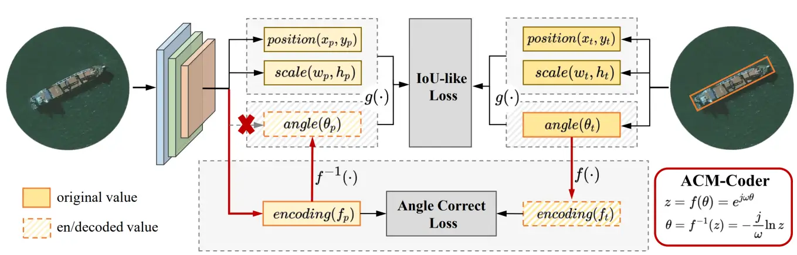

# 🌟 Personal Academic Homepage Template | Responsive & Minimal Deployment

Looking for the Chinese version? [README (中文)](README_cn.md)

This is a personal academic homepage template that balances **PC/mobile responsiveness**, **minimal secondary development**, and **fast content updates**. Built with pure HTML+CSS (no complex dependencies), it can be used directly as a personal homepage (currently [Antxinyuan's academic homepage](https://antxinyuan.github.io/)) or customized in minutes to deploy your own professional academic site!

If this template helps you, please star ⭐️ the repository to show support. If my research work inspires you, feel free to cite the related achievements!


## ✨ Core Features
- 📱 **Full-device Responsiveness**: Automatically adapts to desktops, tablets, and mobile phones with an elegant layout and smooth reading experience
- 🛠️ **Minimal Development**: Relies only on basic HTML+CSS with a clear code structure, making secondary development extremely accessible
- 📝 **Separation of Content & Style**: All personal information (publications, education, etc.) is centralized in a single Markdown file—no style modifications needed for updates
- 🔄 **Auto-synced Data**: One-click crawling and updating of Google Scholar citations and GitHub repo stars (no manual maintenance required)
- 🚀 **Zero-configuration Deployment**: Powered by GitHub Pages + GitHub Actions—automatic deployment after pushing code, no extra setup needed


## 🚀 Quick Installation & Deployment
### Step 1: Create a Repository from the Template
1. Click **Use this template → Create a new repository** in the top-right corner of this repo
2. Name the repository `<your-username>.github.io` (⚠️ Critical: `your-username` must match your GitHub username exactly. For example, my username is `antxinyuan`, so the repo name is `antxinyuan.github.io`)
3. After creation, GitHub will automatically copy all template files to your new repository


### Step 2: Local Preview (Optional but Recommended)
Preview locally before pushing to GitHub to ensure no issues:
```shell
# 1. Clone your repository to your local machine
git clone https://github.com/<your-username>/<your-username>.github.io.git
cd <your-username>.github.io

# 2. Start a simple Python HTTP server (no extra dependencies required)
python -m http.server -b 127.0.0.1
```
Once started, open your browser and visit `127.0.0.1:8000` to view the local version.


### Step 3: Cloud Automatic Deployment
1. After local modifications, commit and push to your GitHub repository:
   ```shell
   git add .
   git commit -m "Update personal info"
   git push origin main
   ```
2. Pushing will automatically trigger the GitHub Actions deployment workflow (no manual configuration needed)
3. After 1-2 minutes, visit `https://<your-username>.github.io` to access your online personal homepage!


## 📝 Customizing Personal Information
All core content is concentrated in **a single file**—no need to touch style code, making it easy for beginners to get started!

### 1. Modify Page Meta Information (SEO Optimization)
Edit the `<head>` section in `index.html` and replace it with your personal information (helps with search engine indexing):
```html
<head>
    <meta http-equiv="Content-Type" content="text/html;charset=utf-8" />
    <meta name="viewport" content="width=device-width, initial-scale=1.0">
    <title>Your Name | Affiliation</title> <!-- Page title -->
    <meta name="description" content="A brief introduction (e.g., PhD student at XX University, research focus on Computer Vision)"> <!-- Search description -->
    <meta name="keywords" content="Your Name, Research Field, Affiliation, Keywords"> <!-- Search keywords -->
    <link rel="shortcut icon" type="image/png" href="images/logo.ico" /> <!-- Favicon (replace images/logo.ico as needed) -->
</head>
```

### 2. Modify Core Content (Publications, Education, etc.)
Edit the **`academic.md`** file (core content file) and replace the content with your own following these formats:

#### 🔍 Publication Format (Auto-renders Tags & Links)
⚠️ Important Rule: Image caption format is `pub|Conference Abbreviation` (e.g., `pub|CVPR24`) to auto-render the conference tag
```markdown
### Publication Category (e.g., 2024 Research Outputs)
 

- **Title**: Rethinking Boundary Discontinuity Problem for Oriented Object Detection
- **Authors**: Hang Xu\*, **Xinyuan Liu\***, Haonan Xu, Yike Ma, Zunjie Zhu, Chenggang Yan and Feng Dai† (\* Co-first author, † Corresponding author)
- **Venue**: ***CVPR 2024*** (<span style="color:#ae1324;">CCF-A</span>) 
  [](Google Scholar Citation Link) 
  [](Repo URL)
- **Resources**: [PDF](Paper PDF Link) / [Supp](Supplementary Material Link) / [arXiv](arXiv Link) / [Code](Code Repo Link) / [Slides](Presentation Slides Link) / [Poster](Poster Link) / [BibTex](Citation Format Link)  
```

#### 🏫 Education Format
⚠️ Important Rule: Image caption format is `edu|Institution Abbreviation` (e.g., `edu|UCAS`) to auto-render the education card
```markdown
### Educational Background
 <!-- Institution logo -->

- **Degree**: Ph.D. candidate
- **Institution**: [Institute of Computing Technology, Chinese Academy of Science (ICT,CAS)](http://www.ict.ac.cn) (replace with your institution's official website)
- **Location**: Beijing, China
- **Period**: Sep. 2021 - Present 
```

#### 📌 Other Content (Highly Extensible)
Add sections like "Research Interests", "Project Experience", "Awards", or "Contact Information" to `academic.md` using the same format—HTML will auto-adapt the style!


## 📂 File Structure Explanation
```shell
<your-username>.github.io/
├── .github/
│   └── workflows/          # Automation configurations (no modifications needed)
│       ├── static.yml      # Automatic webpage deployment script
│       └── scholar_crawler.yml # Automatic Google Scholar citation crawling script
├── README.md               # This documentation (English version)
├── README_CN.md            # Chinese version of the documentation
├── academic.md             # 🔴 Core! Modify all personal content here
├── index.html              # Webpage style framework (only modify <head> meta info)
├── docs/                   # 📁 Publication-related resources (posters, slides, BibTex, etc.)
│   └── cvpr2024/           # Organize by conference/year
├── images/                 # 📁 Image resources (logos, favicon, publication thumbnails, etc.)
│   └── logo.ico            # Favicon (replaceable)
├── scripts/                # 🛠️ Helper scripts (no modifications needed)
│   ├── scholar_crawler.py  # Google Scholar citation crawling script
│   ├── sitemap_generator.py # Sitemap generation script
│   └── scholar.json        # Crawled data storage
├── sitemap.xml             # Search engine sitemap (auto-generated)
└── robots.txt              # Search engine crawling configuration
```


## 🎯 Advanced Feature: Auto-update Citations & Stars
The template includes built-in automation scripts for hassle-free data updates:
1. Google Scholar Citations: Crawled periodically via `scripts/scholar_crawler.py`, configured in `.github/workflows/scholar_crawler.yml` (runs weekly by default—adjust frequency as needed)
2. GitHub Stars: Real-time sync via the badge link `https://img.shields.io/github/stars/<your-github-repo>?style=social`—no extra configuration required


## 🙏 Acknowledgements & Feedback
If you encounter issues, have optimization suggestions, or want to share your customized homepage, feel free to reach out via:
- Submitting a GitHub Issue
- Forking the repository, making improvements, and submitting a Pull Request

Thank you for your support! 🌟 Wishing everyone a sleek and professional academic homepage～