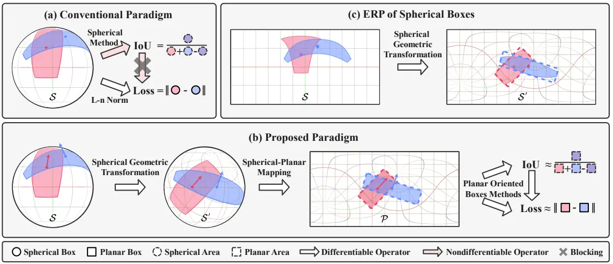
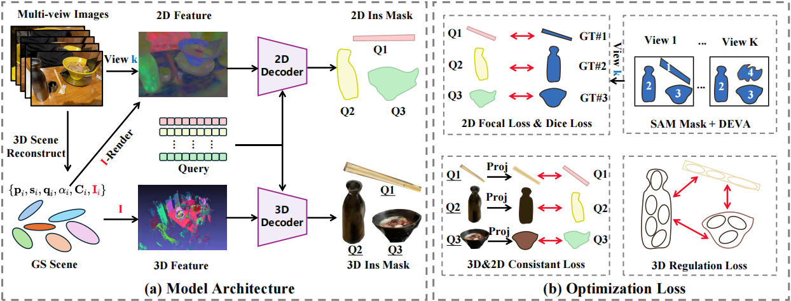
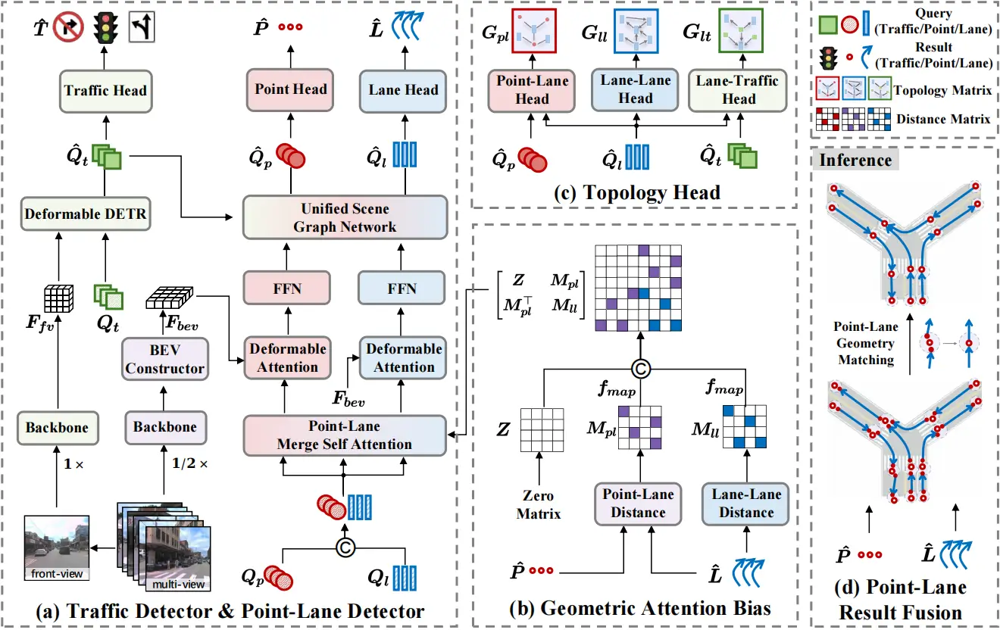
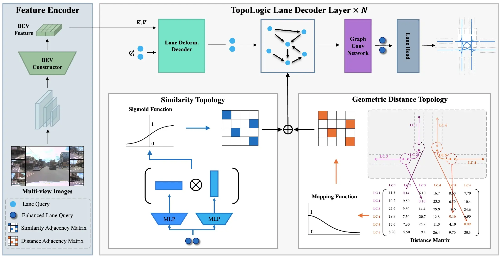
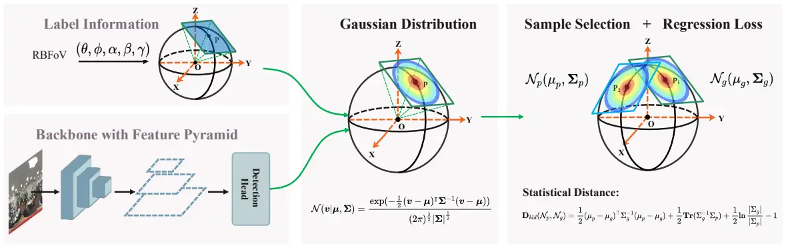
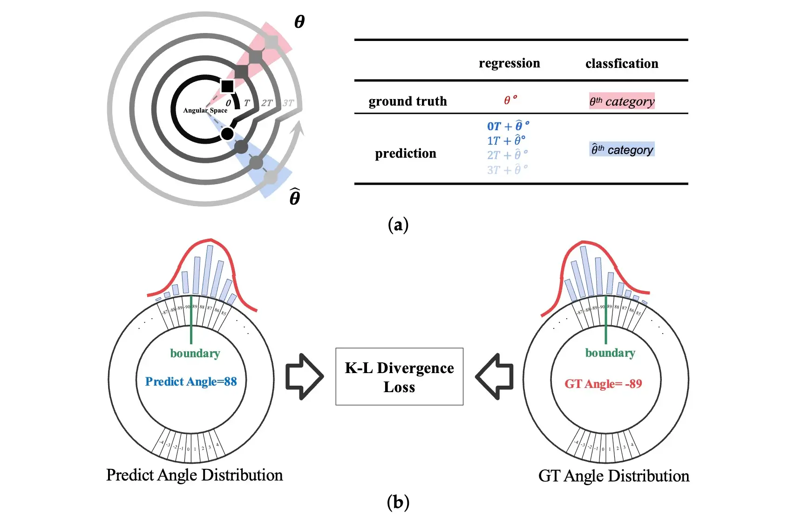
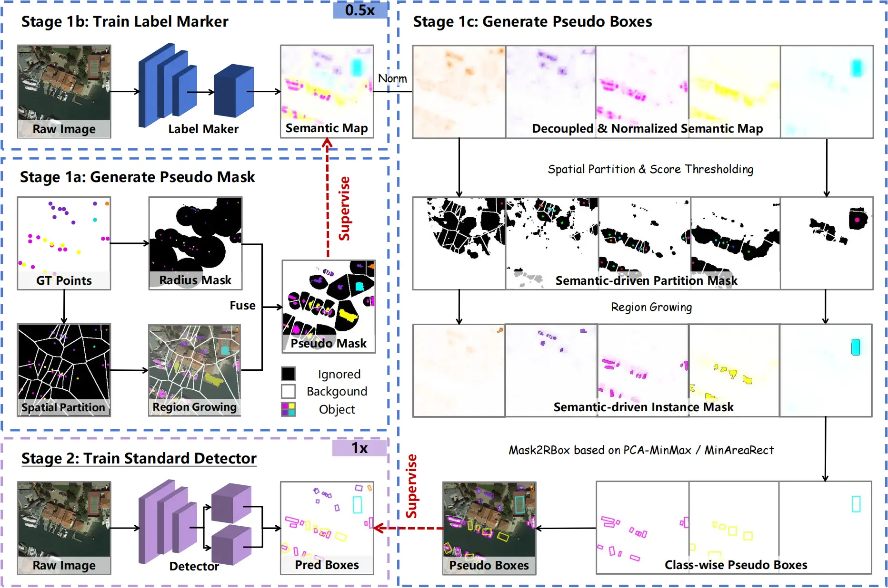

<link rel="stylesheet" href="https://cdn.jsdelivr.net/npm/academicons@1.9.2/css/academicons.min.css">
<link rel="stylesheet" href="https://cdn.jsdelivr.net/npm/font-awesome@4.7.0/css/font-awesome.min.css" >

# Xinyuan Liu (刘 鑫源)

**PhD Student**

<!--<i class="fa fa-building" style="color: #0c4994;"></i> -->
Institute of Computing Technology, Chinese Academy of Sciences (ICT,CAS)  
<!--<i class="fa fa-map-marker" style="color: #0c4994;"></i>-->
Beijing, China  

<i class="fa fa-envelope" style="color: #0c4994;"></i>
Email: [liuxinyuan21s@ict.ac.cn](mailto:liuxinyuan21s@ict.ac.cn)  

<i class="ai ai-google-scholar" style="color: #0c4994;"></i>
[Google Scholar](https://scholar.google.com/citations?user=eXwizz8AAAAJ) / 
<i class="ai ai-semantic-scholar" style="color: #3B5998;"></i>
[Semantic Scholar](https://www.semanticscholar.org/author/Xinyuan-Liu/150344255) /
<i class="ai ai-dblp" style="color: #0c4994;"></i>
[DBLP](https://dblp.org/pid/202/2370-3) / 
<i class="ai ai-orcid" style="color: #A6CE39;"></i>
[ORCID](https://orcid.org/0000-0002-8595-7156) / 
<i class="fa fa-github" style="color: #171515;"></i>
[Github](https://github.com/antxinyuan)  

## 🇨🇳 Biography 
I'm now a Ph.D. student in [Institute of Computing Technology, Chinese Academy of Science](http://www.ict.ac.cn), Beijing, China, starting from Autumn 2021.  
I received the B.E. degree from [School of Computer Science and Technology](https://cs.xidian.edu.cn), [Xidian University](https://www.xidian.edu.cn), Xi'an, China, in 2021.  

I'm interested in computer vision, with a focus on **panoramic/oriented/3D object detection.**  

## 🔥 News
- 11/2025: 🎉 One cooperative paper is accepted by AAAI 2026. 
- 06/2025: 🎉 One paper is released on arXiv. 
- 05/2025: 🎉 One cooperative paper is released on arXiv (accepted by NeurIPS 2025). 
- 05/2024: 🎉 One cooperative paper is released on arXiv (accepted by NeurIPS 2024).  
- 03/2024: 🏆 I’m becoming a Ph.D. student at [Institute of Computing Technology, Chinese Academy of Sciences](http://www.ict.ac.cn).  
- 02/2024: 🎉 One paper is accepted by CVPR 2024. 
- 10/2023: 🏆 I am awarded the National Scholarship for Master's Students. 
- 05/2023: 🎉 One paper is accepted by IJCAI 2023.  
- 02/2023: 🎉 One cooperative paper is accepted by CVPR 2023.  
- 09/2021: 🏆 I’m joining [Institute of Computing Technology, Chinese Academy of Sciences](http://www.ict.ac.cn) as a M.S. student.  

## 📝 Publications  
**Summary**: CVPR & ICCV & ECCV (**2**), ICML & NeurIPS & ICLR (**2**), AAAI & IJCAI & ACM MM (**2**), IEEE Transactions (**0**).  

\* indicates equal contribution, † indicates corresponding author.  

### 💡Conference Papers

### ACM
 

- **Rethinking Boundary Discontinuity Problem for Oriented Object Detection**
- Hang Xu\*, **Xinyuan Liu\***, Haonan Xu, Yike Ma, Zunjie Zhu, Chenggang Yan and Feng Dai†
- ***CVPR 2024*** (CCF-A)  / 
- [PDF](https://openaccess.thecvf.com/content/CVPR2024/papers/Xu_Rethinking_Boundary_Discontinuity_Problem_for_Oriented_Object_Detection_CVPR_2024_paper.pdf) / [Supp](https://openaccess.thecvf.com/content/CVPR2024/supplemental/Xu_Rethinking_Boundary_Discontinuity_CVPR_2024_supplemental.pdf) / [arXiv](https://arxiv.org/abs/2305.10061) / [Code](https://github.com/hangxu-cv/cvpr24acm) / [Slides](docs/cvpr2024/acm_slides.pdf) / [Poster](docs/cvpr2024/acm_poster.pdf) / [BibTex](docs/cvpr2024/bibtex.txt)  

### Sph2Pob
  

- **Sph2Pob: Boosting Object Detection on Spherical Images with Planar Oriented Boxes Methods**
- **Xinyuan Liu**, Hang Xu, Bin Chen, Qiang Zhao, Yike Ma, Chenggang Yan and Feng Dai†  
- ***IJCAI 2023*** (CCF-A)  / 
- [PDF](https://www.ijcai.org/proceedings/2023/0137.pdf) / Supp / arXiv / [Code](https://github.com/antxinyuan/sph2pob) / [Slides](docs/ijcai2023/sph2pob_slides.pdf) / [Poster](docs/ijcai2023/sph2pob_poster.pdf) / [BibTex](docs/ijcai2023/bibtex.txt)  

### IQGS
  

- **IQGS: Instance Query-based Gaussian Segmentation**  
- Yichao Gao, **Xinyuan Liu**, Yike Ma, Yucheng Zhang and Feng Dai†  
- ***AAAI 2026*** (CCF-A)   / 
- PDF / Supp / arXiv / [Code](https://github.com/tom-gao-gyc/iqgs) / Slides / Poster / [BibTex](docs/aaai2026/bibtex.txt)  

### TopoPoint
  

- **TopoPoint: Enhance Topology Reasoning via Endpoint Detection in Autonomous Driving**  
- Yanping Fu, **Xinyuan Liu**, Tianyu Li, Yike Ma, Yucheng Zhang and Feng Dai†  
- ***NeurIPS 2025*** (CCF-A)  / 
- [PDF](https://arxiv.org/pdf/2505.17771) / [Supp](https://arxiv.org/pdf/2505.17771#page=11) / [arXiv](https://arxiv.org/abs/2505.17771) / [Code](https://github.com/franpin/topopoint) / [Slides](docs/neurips2025/topopoint_slides.pdf) / [Poster](docs/neurips2025/topopoint_poster.pdf) / [BibTex](docs/neurips2025/bibtex.txt)  

### TopoLogic
  

- **TopoLogic: An Interpretable Pipeline for Lane Topology Reasoning on Driving Scenes**  
- Yanping Fu, Wenbin Liao, **Xinyuan Liu**, Hang Xu, Yike Ma, Yucheng Zhang and Feng Dai†  
- ***NeurIPS 2024*** (CCF-A) 	 / 
- [PDF](https://proceedings.neurips.cc/paper_files/paper/2024/file/7116cda41d75d580bae15d9e484a8466-Paper-Conference.pdf) / [Supp](https://proceedings.neurips.cc/paper_files/paper/2024/file/7116cda41d75d580bae15d9e484a8466-Supplemental-Conference.zip) / [arXiv](https://arxiv.org/abs/2405.14747) / [Code](https://github.com/franpin/topoLogic) / [Slides](docs/neurips2024/topologic_slides.pdf) / [Poster](docs/neurips2024/topologic_poster.pdf) / [BibTex](docs/neurips2024/bibtex.txt)  

### GLDL
  

- **Gaussian Label Distribution Learning for Spherical Image Object Detection**  
- Hang Xu, **Xinyuan Liu**, Qiang Zhao, Yike Ma, Chenggang Yan and Feng Dai†  
- ***CVPR 2023*** (CCF-A) 
- [PDF](https://openaccess.thecvf.com/content/CVPR2023/papers/Xu_Gaussian_Label_Distribution_Learning_for_Spherical_Image_Object_Detection_CVPR_2023_paper.pdf) / [Supp](https://openaccess.thecvf.com/content/CVPR2023/supplemental/Xu_Gaussian_Label_Distribution_CVPR_2023_supplemental.pdf) / arXiv / Code / [Slides](docs/cvpr2023/gldl_slides.pdf) / [Poster](docs/cvpr2023/gldl_poster.pdf) / [BibTex](docs/cvpr2023/bibtex.txt)  

### 🔬Journal Papers

### GDL
  
- **Rotated Object Detection with Circular Gaussian Distribution**  
- Hang Xu, **Xinyuan Liu**, Yike Ma, Zunjie Zhu, Shuai Wang, Chenggang Yan and Feng Dai†  
- ***Electronics 2023***  (SCI-Q2, IF=2.6)	
- [PDF](https://pdfs.semanticscholar.org/e6c0/7c88e0dca164d5f318c9dc3eac69f5c82f88.pdf) / Supp / arXiv / Code / Slides / Poster / [BibTex](docs/electronics2023/bibtex.txt)

### ⏳Preprint Papers

### SSP
  

- **Semantic-decoupled Spatial Partition Guided Point-supervised Oriented Object Detection**  
- **Xinyuan Liu**, Hang Xu, Yike Ma, Yucheng Zhang and Feng Dai†  
- ***arXiv 2025*** (preprint)  / 
- [PDF](https://arxiv.org/pdf/2506.10601) / Supp / [arXiv](https://arxiv.org/abs/2506.10601) / [Code](https://github.com/antxinyuan/ssp) / Slides / Poster / [BibTex](docs/arxiv2025b/bibtex.txt)

## 🎓 Education
### UCAS

- **Ph.D.** candidate, [Institute of Computing Technology, Chinese Academy of Science (ICT,CAS)](http://www.ict.ac.cn) 
- Beijing, China 
- Sep. 2021 - Now 

### XDU

- **B.E.** degree, [School of Computer Science and Technology](https://cs.xidian.edu.cn), [Xidian University (XDU)](https://www.xidian.edu.cn) 
- Xi'an, China 
- Sep. 2017 - Jun. 2021 

### FGZX

- Fugu Middle School of Shaanxi 
- Fugu, China 
- Sep. 2014 - Jun. 2017 

## 🎖 Awards  
- Master's National Scholarship, 2023  
- ICT × E Fund Scholarship, 2022  
- Outstanding Graduates of Universities in Shaanxi Province, 2021  
- XDU × Oupalm Scholarship, 2019  
- First-Class Academic Scholarship, 2018, 2019, 2020, 2022, 2023  

&copy; Xinyuan Liu | <a href="https://github.com/antxinyuan/antxinyuan.github.io">Last updated: Nov, 2025</a>

