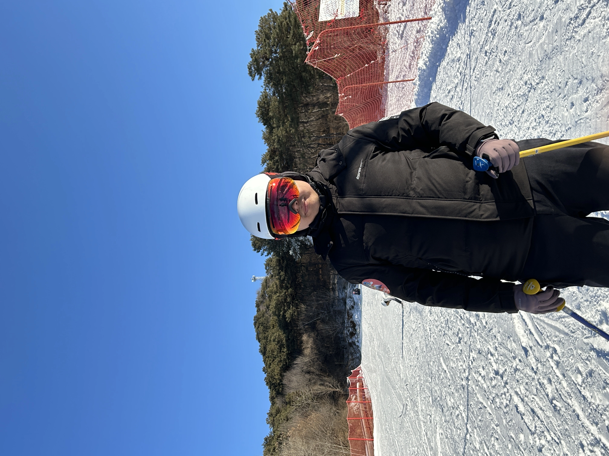
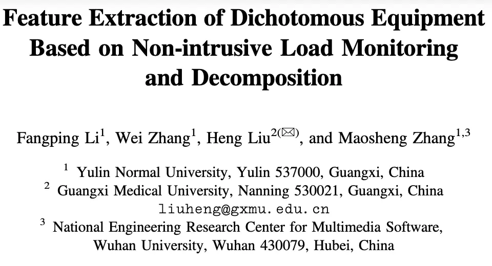
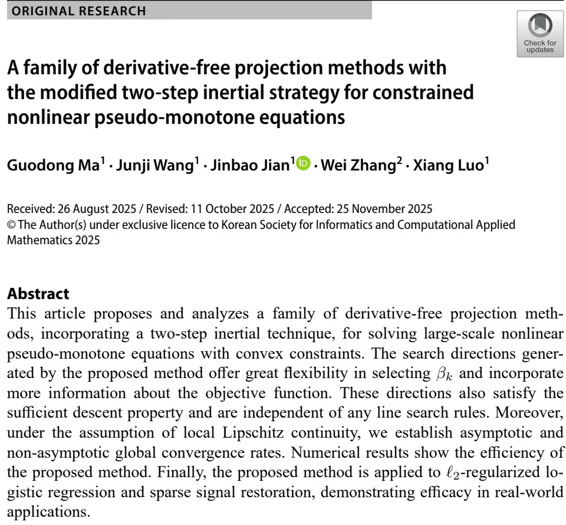
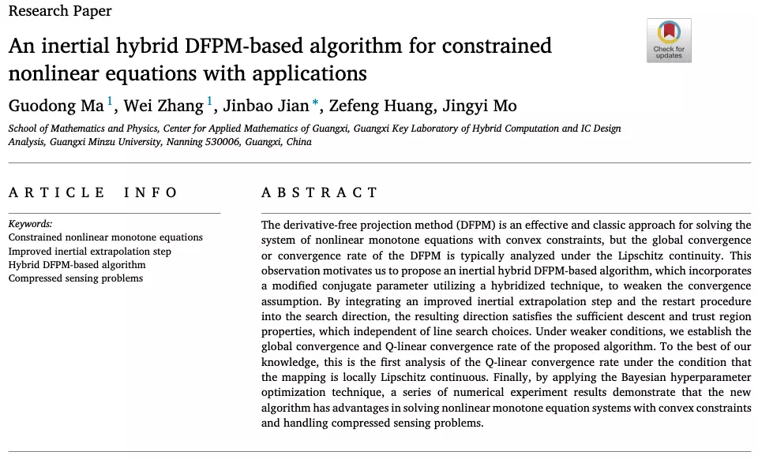
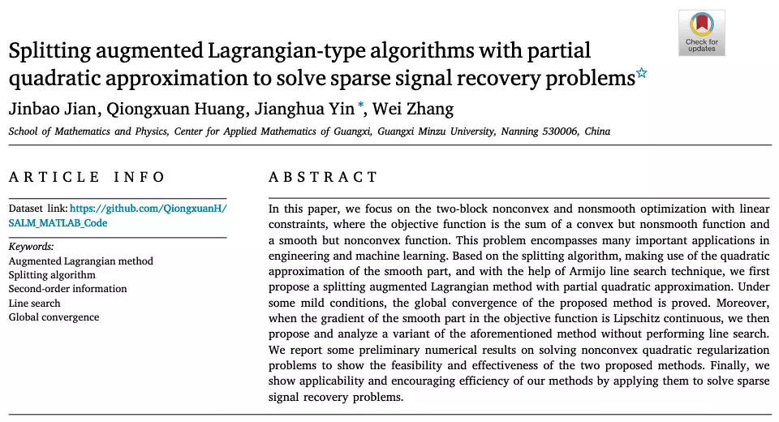
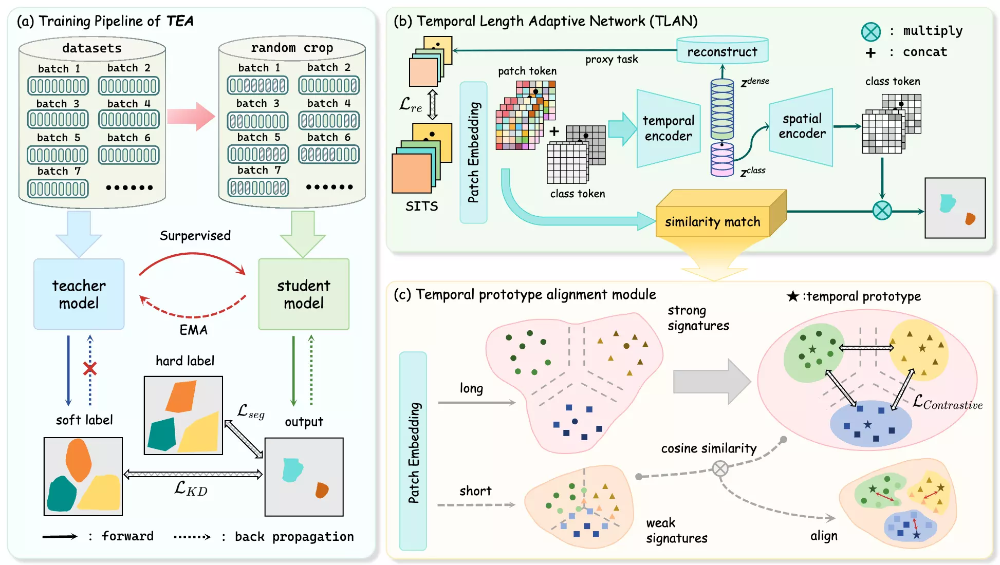

<link rel="stylesheet" href="https://cdn.jsdelivr.net/npm/academicons@1.9.2/css/academicons.min.css">
<link rel="stylesheet" href="https://cdn.jsdelivr.net/npm/font-awesome@4.7.0/css/font-awesome.min.css" >

    

        <h1 style="margin-top: 0;">Wei Zhang (张 蔚)</h1>
        
<strong>PhD Student</strong>

        

            Institute of Computing Technology, Chinese Academy of Sciences (ICT, CAS) 
            Beijing, China
        

        

            <i class="fa fa-envelope" style="color: #0c4994;"></i> 
            Email: <a href="mailto:zhangwei25b@ict.ac.cn">zhangwei25b@ict.ac.cn</a>
        

        

            <i class="ai ai-orcid" style="color: #A6CE39;"></i> 
            <a href="https://orcid.org/0000-0002-1793-0306">ORCID</a> / 
            <i class="ai ai-google-scholar" style="color: #0c4994;"></i> 
            <a href="https://scholar.google.com/citations?user=uid0wgYAAAAJ">Google Scholar</a> / 
            <i class="fa fa-github" style="color: #171515;"></i> 
            <a href="https://github.com/zhangwei-1999">Github</a> /
            <i class="ai ai-semantic-scholar" style="color: #3B5998;"></i> 
            <a href="https://www.semanticscholar.org/author/Wei-Zhang/2299556404">Semantic Scholar</a> /
            <i class="ai ai-dblp" style="color: #0c4994;"></i> 
            <a href="https://dblp.org/pid/10/4661-225">DBLP</a>
        

    

    

        

            
        

    

## 🇨🇳 Biography

I am currently pursuing a Ph.D. degree in Engineering at [Institute of Computing Technology, Chinese Academy of Science](http://www.ict.ac.cn), Beijing, China, starting from Autumn 2025.  
I received my M.S. degree from the [School of Mathematical Sciences](https://col-sci.gxmzu.edu.cn/), [Guangxi Minzu University](https://www.gxmzu.edu.cn/), Guangxi, China, in 2025. During my master's studies, my research focused on operations research algorithms and theory. I hold a B.S. degree from the [School of Mathematics and Statistics](https://stxy.ylu.edu.cn/), [Yulin Normal University](https://www.ylu.edu.cn/), Guangxi, China, in 2021.

I'm interested in Computer Vision, Optimization,  with a focus on **3D reconstruction, 3D generation and Optimization algorithms.**  

## 🔥 News

- 02/2026: 🎉 One cooperative paper is accepted by ***Journal of Applied Mathematics and Computing***. 
- 01/2026: 📝 One cooperative paper is released on arXiv. [TEA: Temporal Adaptive Satellite Image Semantic Segmentation.](https://arxiv.org/abs/2601.04956)
- 09/2025: 🎓 I’m becoming a Ph.D. student at [Institute of Computing Technology, Chinese Academy of Sciences](http://www.ict.ac.cn). 
- 05/2025: 💼 Conference presentation, ***CSSC 2025***, Guiyang, Guizhou.
- 03/2025: 🎉 One paper is accepted by ***Applied Numerical Mathematics***. 
- 01/2025: 🎉 One paper is accepted by ***Electronics Letters***. 
- 11/2024: 🏆 The 21st China Post-Graduate Mathematical Contest in Modeling. **Second Prize**.
- 10/2024: 🎉 One cooperative paper is accepted by ***Journal of Computational and Applied Mathematics***.  
- 10/2024: 💼 Conference presentation, ***ORSC 2024***, Guiyang, Guizhou.
- 12/2023: 🏆 The 20st China Post-Graduate Mathematical Contest in Modeling. **Third Prize**.
- 11/2023: 💼 Conference, ***Standing Council of the MP Branch of the CORS***, Nanning, Guangxi.
- 09/2022: 🎓 I’m joining the [School of Mathematical Sciences](https://col-sci.gxmzu.edu.cn/), [Guangxi Minzu University](https://www.gxmzu.edu.cn/) as a M.S. student. 
- 12/2020: 🏆 2020 **National Scholarship**.
- 12/2019: 🏆 2019 **Guangxi People's Government Scholarship**.
- 05/2019: 💼 Conference presentation, ***CSSC 2019***, Changsha, Hunan.
- 11/2018: 💼 Conference, ***ICA3PP 2018***, Guangzhou, Guangdong.
- 05/2018: 🎉 One cooperative paper is accepted by ***ICA3PP 2018***.  
- 09/2017: 🎓 I’m joining the [School of Mathematics and Statistics](https://stxy.ylu.edu.cn/), [Yulin Normal University](https://www.ylu.edu.cn/) as a B.S. student. 

## 📝 Publications

**Summary**: Conference (**1**), Journal (**4**).

\* indicates equal contribution, † indicates corresponding author.  

### 💡Conference Papers

### ICA3PP

- **Feature Extraction of Dichotomous Equipment Based on Non-intrusive Load Monitoring and Decomposition**
- Fangping Li, **Wei Zhang**, Heng Liu†, Maosheng Zhang
- ***ICA3PP 2018*** (CCF-C) 
- [PDF](https://link.springer.com/chapter/10.1007/978-3-030-05234-8_24) / Supp / arXiv / Code / Slides / Poster / [BibTex](docs/C-ICA3PP/bibtex.txt)  

### 🔬Journal Papers

### JAMC

  

- **A Family of Derivative-free Projection Methods with The Modified Two-step Inertial Strategy for Constrained Nonlinear Pseudo-monotone Equations**  
- Guodong Ma\*, Junji Wang\*, Jinbao Jian†, **Wei Zhang**, Xiang Luo  
- ***Journal of Applied Mathematics and Computing 2026***  (SCI-Q1, IF=2.7)	
- [PDF](https://link.springer.com/article/10.1007/s12190-025-02731-6) / Supp / arXiv / Code / Slides / Poster / [BibTex](docs/J-JAMC/bibtex.txt)

### EL

  

- **Reconstruction of Three‐dimensional Sound Field System Based on Machine Learning Method**  
- **Wei Zhang**, Maosheng Zhang†, Xiaoyan Sun, Jingyi Mo  
- ***Electronics Letters 2025***  (SCI-Q4, IF=0.9)	
- [PDF](https://ietresearch.onlinelibrary.wiley.com/doi/epdf/10.1049/ell2.70133) / Supp / arXiv / Code / Slides / Poster / [BibTex](docs/J-EL/bibtex.txt)

### ANM

  

- **An Inertial Hybrid DFPM-based Algorithm for Constrained Nonlinear Equations with Applications**  
- Guodong Ma\*, **Wei Zhang**\*, Jinbao Jian†, Zefeng Huang, Jingyi Mo
- ***Applied Numerical Mathematics 2025***  (SCI-Q1, IF=2.4)	
- [PDF](https://www.sciencedirect.com/science/article/abs/pii/S0168927424003179) / Supp / arXiv / Code / Slides / Poster / [BibTex](docs/J-ANM/bibtex.txt)

### JCAM

  

- **Splitting Augmented Lagrangian-type Algorithms with Partial Quadratic Approximation to Solve Sparse Signal Recovery Problems**  
- Jinbao Jian, Qiongxuan Huang, Jianghua Yin†, **Wei Zhang**  
- ***Journal of Computational and Applied Mathematics 2024***  (SCI-Q1, IF=2.6)	
- [PDF](https://www.sciencedirect.com/science/article/abs/pii/S037704272400222X) / Supp / arXiv / Code / Slides / Poster / [BibTex](docs/J-JCAM/bibtex.txt)

### ⏳Preprint Papers

### TEA

  

- **TEA: Temporal Adaptive Satellite Image Semantic Segmentation**  
- Juyuan Kang\*, Hao Zhu\*, Yan Zhu, **Wei Zhang**, Jianing Chen, Tianxiang Xiao, Yike Ma, Hao Jiang, Feng Dai†  
- ***arXiv 2026*** (preprint)  / 
- [PDF](https://arxiv.org/pdf/2601.04956) / Supp / [arXiv](https://arxiv.org/abs/2601.04956) / [Code](https://github.com/KeplerKang/TEA) / Slides / Poster / [BibTex](docs/A-arxiv26/bibtex.txt)

## 🎓 Education
### UCAS

- **Ph.D.** candidate, [Institute of Computing Technology, Chinese Academy of Science (ICT, CAS)](http://www.ict.ac.cn) 
- Beijing, China 
- Sep. 2025 - Now 

### GXMU

- **M.S.** degree, [School of Mathematical Sciences](https://col-sci.gxmzu.edu.cn/), [Guangxi Minzu University, GXMU](https://www.gxmzu.edu.cn/) 
- Guangxi, China 
- Sep. 2022 - Jun. 2025 

### YLNU

- **B.S.** degree, [School of Mathematics and Statistics](https://stxy.ylu.edu.cn/), [Yulin Normal University, YNU](https://www.ylu.edu.cn/)
- Guangxi, China 
- Sep. 2017 - Jun. 2021 

## 🎖 Awards

- GMU **Academic Scholarship**, ***2023***, ***2024***. 
- The 21st China Post-Graduate Mathematical Contest in Modeling. **Second Prize**. ***2024***.
- The 13th Micro Course Design Test for Mathematics Teachers in Higher Education Institutions. **First Prize**. ***2024***.
- The 20st China Post-Graduate Mathematical Contest in Modeling. **Third Prize**. ***2023***.
- **National Scholarship**. ***2020***.
- **Guangxi People's Government Scholarship**. ***2019***.
- The 9th National Mathematics Teacher Training Student Course Creation and Teaching Ability Test and Exchange Exhibition Competition. **First Prize**. ***2019***.
- China Undergraduate Mathematical Contest in Modeling. Guangxi, **Third Prize**. ***2019***.
- The Chinese Mathematics Competitions for College Students (major in mathematics). Guangxi, **Third Prize**. ***2018***.
- China Undergraduate Mathematical Contest in Modeling. Guangxi, **Third Prize**. ***2018***.

&copy; Wei Zhang | <a href="https://github.com/zhangwei-1999/zhangwei-1999.github.io">Last updated: Jan, 2026</a>

